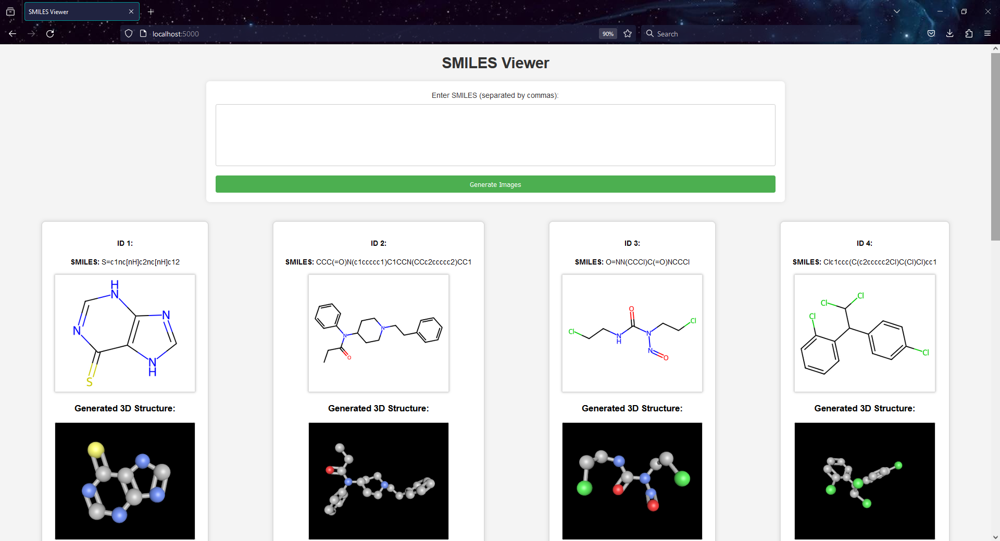

# SMILES Viewer 🌐🔬

SMILES Viewer is a web application built with Flask that allows users to input SMILES strings, visualize their 2D and 3D molecular structures, and view relevant molecular information.

## Features 🚀

- **SMILES Input:** Enter SMILES strings (separated by commas) through a user-friendly form.
- **2D Structure Visualization:** View generated 2D molecular structures along with isomeric SMILES.
- **3D Structure Visualization:** Explore 3D molecular structures using ChemDoodleWeb.
- **Molecular Information:** Retrieve molecular information, including formula, exact mass, and molecular weight (currently Hide) .

## Demo Image



## Getting Started 🏁

1. **Clone the Repository:**
   ```bash
   git clone https://code.topiatech.co.uk/uttam.pipaliya/SMILES-Viewer.git
   cd SMILES-Viewer
   ```

2. **Install Dependencies:**
   ```bash
   pip install -r requirements.txt
   ```

3. **Run the Application:**
   ```bash
   python app.py
   ```

4. **Access the Application:**
   Open your web browser and go to [http://localhost:5000](http://localhost:5000)

## Usage 🧪

1. Open the web application in your browser.
2. Enter SMILES strings in the input box (separated by commas).
3. Click the "Generate Images" button.
4. View the generated 2D and 3D molecular structures along with molecular information.

## Technologies Used 💻

- Flask
- RDKit
- ChemDoodleWeb
- HTML/CSS
- JavaScript

